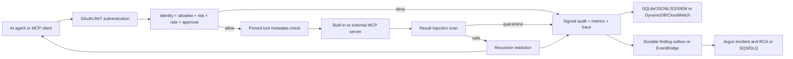

# Verdikt

Verdikt is a deterministic security and reliability control plane for Model Context Protocol (MCP) tool execution. It governs the request before an external tool runs, inspects the untrusted result before it reaches an agent, and produces tamper-evident operational evidence for both decisions.

The core demo runs on an 8 GB laptop with Python only, no local model, and no API key. Optional profiles add the official MCP SDK, Redis, OpenTelemetry/OpenInference, Docker observability, AWS deployment, and a Groq incident summary. No LLM participates in an allow or deny decision.

## Why This Project

An MCP server can expose operationally powerful tools to an AI agent. The interesting production question is not whether the agent can call a tool. It is whether the platform can constrain, observe, disable, and explain those calls under pressure.

Verdikt demonstrates:

- MCP gateway proxying over JSON-RPC stdio
- Official MCP SDK Streamable HTTP server for production-facing clients
- Operator-configured proxying to independently built stdio MCP servers
- Versioned interoperability harness for official Filesystem, Memory, and GitHub MCP servers
- Minimal subprocess environments that expose only explicitly brokered upstream credentials
- Recursive tool-description and JSON Schema inspection before trust
- SHA-256 tool-definition pinning and fail-closed rug-pull detection
- Deterministic direct and indirect prompt-injection inspection
- Quarantine envelopes that do not return malicious text to the agent
- Policy-as-code allowlists and blocked argument patterns
- JWT/OIDC resource-server authentication with issuer, audience, group, and scope validation
- Authenticated-subject binding that rejects caller actor spoofing
- OAuth protected-resource metadata and caller-token passthrough denial
- Scoped OAuth challenges and exact HTTP Origin validation
- HMAC-signed approval tokens for restart and rollback operations
- Slack button approvals with signed callbacks, approver allowlists, deduplication, and replay protection
- Rollback-plan enforcement before production-impacting actions execute
- Dry-run-only and shadow-mode outcomes for safe agent evaluation
- Deterministic risk scoring for production actions
- Secret redaction for audit logs and agent-visible responses
- Per-tool rate limits and immediate kill switches
- Optional Redis-backed distributed rate limits for multi-replica deployments
- Atomic Redis counters with privacy-preserving hashed actor/tool keys and live multi-instance CI
- Circuit breakers for repeated upstream tool failures
- Hash-chained and optionally HMAC-signed local audit evidence
- Fail-closed audit signing and full-chain startup verification for production mode
- JSONL, S3, generic HTTPS SIEM, or Splunk HEC audit shipping plus individually signed DynamoDB serverless events
- Reusable AWS Secrets Manager and Vault KV secret brokerage across runtime credentials
- Correlation IDs, Prometheus metrics, OpenInference/OpenTelemetry traces, and AWS X-Ray
- Docker Compose observability stack with Prometheus, Grafana, Tempo, Jaeger, and Redis
- Helm chart for Kubernetes deployment
- Optional Groq incident analysis with an offline fallback
- Optional OpenInference-compatible traces exported through OpenTelemetry
- MCP-38 coverage matrix and adversarial policy regression suite
- MCP-AttackBench-compatible dataset adapter with per-category metrics and privacy-safe reports
- Reproducible full-pipeline latency, overhead, throughput, and audit-integrity benchmark
- Durable blocked-finding export that creates deduplicated incidents in Argus's RCA pipeline
- AWS Secrets Manager, X-Ray tracing, IAM review, SLOs, runbooks, and failure-mode tests

## Architecture



The upstream tool servers are separate subprocesses:

- `platform-ops`: production service health, sanitized config, logs, allowlisted diagnostics, rolling restart, and deployment rollback.
- `kubernetes`: pod status, guarded pod restart, and rollout status. It uses a safe simulator by default and can be pointed at `kubectl` with `VERDIKT_KUBERNETES_MODE=kubectl` for a controlled lab.
- `incident`: create incidents, attach correlated evidence, and read timelines.

## Quick Start

Requirements: macOS or Linux and Python 3.11+.

The launch scripts automatically use `.venv/bin/python` when a project virtual environment exists. Otherwise, they use the system `python3`.

To use an isolated audit database for a run:

```bash
./scripts/run_demo.sh --audit-db /tmp/verdikt-demo.db
```

```bash
./scripts/run_demo.sh
```

Common developer commands:

```bash
make test
make demo
make eval
make attackbench-smoke
make performance-smoke
make failure-test
make interop-community
make trace
make observability-up
make helm-template
```

`make test` is the canonical release gate for all Tier 1, Tier 2, and Tier 3 work. It provisions isolated Redis and Vault containers, runs the complete unit/integration/end-to-end suite once, enforces aggregate and security-critical branch coverage, executes adversarial and failure drills, measures guarded-call performance, and verifies the pinned official Filesystem and Memory MCP servers. Existing Redis and Vault endpoints can be supplied through `VERDIKT_TEST_REDIS_URL`, `VERDIKT_TEST_VAULT_ADDR`, and `VERDIKT_TEST_VAULT_TOKEN`.

Start the dashboard:

```bash
./scripts/run_dashboard.sh
```

Then open [http://127.0.0.1:8080](http://127.0.0.1:8080). The page includes buttons for allowed calls, blocked calls, an approved rollback drill, secret redaction, and kill-switch testing.

Loopback is the only unauthenticated mode. Binding to any other interface fails
closed unless `VERDIKT_API_TOKEN` is set. The browser asks for the token once
and keeps it in session storage.

To expose Verdikt itself as a stdio MCP server:

```bash
./scripts/run_mcp_gateway.sh
```

For an MCP client configuration, use:

```json
{
  "mcpServers": {
    "verdikt": {
      "command": "/absolute/path/to/Verdikt/scripts/run_mcp_gateway.sh"
    }
  }
}
```

### External MCP Servers

Set `VERDIKT_UPSTREAM_CONFIG` to a JSON file using the shape in [`config/upstreams.example.json`](config/upstreams.example.json). Commands are executed directly without a shell. Sensitive upstream credentials should use `from_env` or `from_aws_secret`; caller-supplied OAuth tokens are denied recursively by policy.

The test suite launches [`tests/fixtures/external_mcp_server.py`](tests/fixtures/external_mcp_server.py) as an independent process and proves normal and text-only responses, paginated discovery, server-initiated requests, environment isolation, injected-result quarantine, and changed metadata blocking. The versioned [community interoperability harness](docs/COMMUNITY_INTEROP.md) separately targets the official MCP Filesystem and Memory servers plus GitHub's official read-only server.

## Optional Groq Integration

The demo produces a deterministic local incident summary by default. To add a hosted LLM summary:

```bash
export GROQ_API_KEY="your-key"
export GROQ_MODEL="openai/gpt-oss-20b"
./scripts/run_demo.sh
```

The gateway keeps working if Groq is unavailable. Policy evaluation never depends on the model.

## Dashboard API

| Endpoint | Purpose |
| --- | --- |
| `GET /healthz` | Readiness check |
| `GET /api/tools` | List upstream MCP tools |
| `GET /api/events` | Read recent correlated audit events |
| `GET /api/kill-switches` | Read disabled tools and servers |
| `GET /api/telemetry` | Read OpenInference tracing mode and OTLP endpoint |
| `GET /api/audit-integrity` | Verify the local audit hash chain and signatures |
| `GET /metrics` | Prometheus-style counters |
| `POST /api/call` | Invoke a guarded tool |
| `POST /api/approval` | Issue a short-lived approval token |
| `POST /api/kill-switch` | Enable or disable a tool or server |
| `POST /api/analyze` | Summarize recent audit evidence |

Example:

```bash
curl -s http://127.0.0.1:8080/api/call \
  -H 'Content-Type: application/json' \
  -d '{"server":"platform-ops","tool":"platform.health","arguments":{"service":"payments-api"}}'
```

Issue a signed approval token for a rollback:

```bash
TOKEN=$(./scripts/python.sh -m verdikt.cli issue-approval \
  --actor gaurav \
  --reason "rollback after elevated 5xx rate" \
  --server platform-ops \
  --tool platform.rollback_deployment \
  --arguments '{"service":"payments-api","version":"payments-api@2026.05.2","actor":"gaurav","rollback_plan":"verify service health and restore previous release if errors increase"}')

curl -s http://127.0.0.1:8080/api/call \
  -H 'Content-Type: application/json' \
  -d "{\"server\":\"platform-ops\",\"tool\":\"platform.rollback_deployment\",\"arguments\":{\"service\":\"payments-api\",\"version\":\"payments-api@2026.05.2\",\"actor\":\"gaurav\",\"rollback_plan\":\"verify service health and restore previous release if errors increase\",\"approval_token\":\"$TOKEN\"}}"
```

## Test

```bash
PYTHONPATH=src ./scripts/python.sh -m unittest discover -s tests -v
```

The suite exercises the actual subprocess MCP boundary as well as allow, deny, redaction, approval, kill-switch, circuit-breaker, audit, and fallback-analysis behavior.

Run the adversarial eval harness:

```bash
./scripts/run_evals.sh
```

The evals cover unsafe diagnostics, direct prompt injection, token passthrough, unapproved destructive actions, unknown tools, safe diagnostics, health checks, and audit redaction. The report also validates all 38 entries in [`config/mcp38_coverage.json`](config/mcp38_coverage.json): currently 12 covered, 21 partial, and 5 explicitly not covered under the definition stored in that file.

The separate [MCP-AttackBench-compatible evaluator](docs/ATTACKBENCH.md) reads JSONL, JSON, CSV, or optional Parquet datasets and reports accuracy, precision, recall, F1, false-positive/negative rates, per-category coverage, latency percentiles, throughput, and input/policy digests. Its bundled eight-sample CI fixture validates the adapter; it is not represented as a result on the independent 70,448-sample corpus.

Run the failure-mode harness:

```bash
./scripts/run_failure_tests.sh
```

It validates approval gates, kill switches, circuit breakers, redaction, and rate limits.

## Docker

Build and run the production-facing real MCP container:

```bash
make docker-build
docker run --rm -p 8080:8080 \
  -e VERDIKT_HTTP_BEARER_TOKEN="local-dev-token" \
  verdikt:local
```

The container binds to `0.0.0.0`, so startup fails closed unless bearer/JWT auth is configured or `VERDIKT_ALLOW_UNAUTHENTICATED_REMOTE=true` is explicitly set for an isolated lab.

The container defaults to the official MCP Streamable HTTP server:

```text
GET  /healthz
GET  /metrics
POST /mcp
GET  /mcp
```

Use a bearer token for remote demos:

```bash
docker run --rm -p 8080:8080 \
  -e VERDIKT_HTTP_BEARER_TOKEN="$(openssl rand -hex 24)" \
  verdikt:local
```

To run the dashboard container instead:

```bash
docker run --rm -p 8080:8080 \
  -e VERDIKT_MODE=dashboard \
  -e VERDIKT_API_TOKEN="$(openssl rand -hex 24)" \
  verdikt:local
```

Dashboard API clients must send `Authorization: Bearer $VERDIKT_API_TOKEN`.
The health endpoint and dashboard page remain unauthenticated; dashboard APIs
and `/metrics` are protected.

## Real MCP Server

Verdikt now includes an official MCP SDK server using Streamable HTTP. It exposes production-operations tools through the same policy, risk, approval, redaction, audit, metrics, kill-switch, rate-limit, and circuit-breaker controls used by the rest of the project.

Run locally:

```bash
export VERDIKT_HTTP_BEARER_TOKEN="local-dev-token"
./scripts/run_real_mcp_http.sh --host 127.0.0.1 --port 8080
```

MCP endpoint:

```text
http://127.0.0.1:8080/mcp
```

Production-style tools exposed by the MCP server:

- `platform.health`
- `platform.read_config`
- `platform.read_logs`
- `platform.run_diagnostic`
- `platform.restart_deployment`
- `platform.rollback_deployment`
- `kubernetes.get_pod`
- `kubernetes.restart_pod`
- `kubernetes.rollout_status`
- `incident.create`
- `incident.attach_evidence`
- `incident.timeline`
- `verdikt.issue_approval`
- `verdikt.request_approval`
- `verdikt.approval_status`
- `verdikt.call_upstream`
- `verdikt.set_tool_enabled`
- `verdikt.set_server_enabled`
- `verdikt.runtime_state`

## AWS Free-Tier Deployment

The primary complete AWS path is Terraform-managed EC2 running the official Streamable HTTP MCP container, with ECR, IAM, Secrets Manager, SSM Session Manager, and encrypted EBS. The Lambda/API Gateway/DynamoDB/EventBridge/SQS stack is a separate serverless control-plane lab with CloudWatch and X-Ray; it exercises stronger AWS serverless skills but exposes an HTTP tool API rather than claiming to be the official MCP transport. The free-tier EC2 path is a restricted-CIDR lab endpoint, not a TLS-terminated public production endpoint.

Start with [docs/AWS_FREE_TIER_DEPLOY.md](docs/AWS_FREE_TIER_DEPLOY.md), then use [docs/AWS_AIOPS_SKILLS.md](docs/AWS_AIOPS_SKILLS.md) to turn the work into an AIOps/LLMOps learning roadmap.

For JWT auth, Redis-backed rate limits, Grafana/Tempo/Jaeger, and Helm usage, see [docs/PRODUCTION_ENHANCEMENTS.md](docs/PRODUCTION_ENHANCEMENTS.md).

Recommended serverless command shape:

```bash
export AWS_REGION=us-east-1
export VERDIKT_API_TOKEN="$(openssl rand -hex 24)"
export VERDIKT_APPROVAL_SECRET="$(openssl rand -hex 32)"
export VERDIKT_AUDIT_HMAC_SECRET="$(openssl rand -hex 32)"
./scripts/aws/deploy_serverless.sh
```

Destroy the serverless deployment after demos:

```bash
./scripts/aws/destroy_serverless.sh
```

EC2 Terraform command shape:

```bash
export AWS_REGION=us-east-1
export VERDIKT_ALLOWED_CIDR="$(curl -s https://checkip.amazonaws.com)/32"
export VERDIKT_HTTP_BEARER_TOKEN="$(openssl rand -hex 24)"
export VERDIKT_APPROVAL_SECRET="$(openssl rand -hex 32)"
export VERDIKT_AUDIT_HMAC_SECRET="$(openssl rand -hex 32)"
./scripts/aws/deploy_terraform.sh
```

Destroy the Terraform deployment after demos:

```bash
./scripts/aws/destroy_terraform.sh
```

CloudFormation fallback:

```bash
export AWS_REGION=us-east-1
IMAGE_URI=$(./scripts/aws/build_push_ecr.sh)
./scripts/aws/deploy_ec2.sh "$IMAGE_URI"
```

Delete the CloudFormation stack after demos:

```bash
./scripts/aws/delete_stack.sh
```

## Optional OpenInference Tracing

The default demo has no third-party runtime dependencies. For AI-aware distributed traces, install the observability profile:

```bash
python3 -m pip install -e '.[observability]'
```

Print OpenInference-compatible spans to the terminal:

```bash
VERDIKT_TELEMETRY=console ./scripts/run_demo.sh
```

Export spans over OTLP HTTP to a local Phoenix instance or another OTLP-compatible backend:

```bash
export VERDIKT_TELEMETRY=otlp
export OTEL_EXPORTER_OTLP_TRACES_ENDPOINT=http://127.0.0.1:6006/v1/traces
./scripts/run_dashboard.sh
```

The trace hierarchy is intentionally security-aware:

```text
verdikt.call_tool                 CHAIN
  verdikt.policy.evaluate         GUARDRAIL
  mcp.platform.health               TOOL       # only created for forwarded calls
groq.incident_summary               LLM        # only created when Groq is called
```

Arguments and outputs are redacted before they are attached to spans. The remote server uses the official MCP Python SDK, while Verdikt emits explicit policy, tool, and LLM spans so security decisions have stable attributes independent of auto-instrumentation. External stdio upstreams remain separate processes and do not yet propagate trace context across that process boundary.

## Threat Model

Implemented and tested controls directly address:

- Agent attempts to access sensitive local paths such as `.ssh`, `.aws`, and `.env`.
- Agent attempts to run unsafe network commands in diagnostic arguments.
- Direct prompt injection embedded in tool arguments.
- Indirect prompt injection embedded in an external MCP tool result.
- Poisoned tool descriptions, nested schema fields, exact-name shadowing, and rug pulls.
- Caller token passthrough and authenticated actor spoofing.
- Unauthorized restart or rollback actions.
- Secret leakage from upstream tool responses or recorded arguments.
- Repeated high-volume calls to expensive or destructive tools.
- Fast containment of a compromised tool or MCP server.
- Audit-record mutation and loss of local-only evidence through optional central shipping.

Explicit gaps remain: Verdikt is an OAuth resource server, not an authorization server; PKCE and per-client consent belong in the chosen IdP/client flow. It does not yet provide multi-tenant isolation, semantic DLP for privacy inference, complete Host-header and deployment-edge DNS-rebinding defenses beyond Origin validation, cryptographically signed policy bundles, OS-level upstream sandboxes, or complete MCP resource/prompt proxying. The coverage matrix treats these as partial or not covered rather than presenting the project as universally production complete.

## Design Notes

The short design write-up is in [docs/DESIGN_NOTES.md](docs/DESIGN_NOTES.md), the production roadmap is in [docs/ROADMAP.md](docs/ROADMAP.md), the AWS learning plan is in [docs/AWS_AIOPS_SKILLS.md](docs/AWS_AIOPS_SKILLS.md), and the production operations docs are in [docs/SLO.md](docs/SLO.md), [docs/RUNBOOKS.md](docs/RUNBOOKS.md), [docs/IAM_REVIEW.md](docs/IAM_REVIEW.md), [docs/TRACING.md](docs/TRACING.md), [docs/PERFORMANCE.md](docs/PERFORMANCE.md), [docs/FAILURE_TESTING.md](docs/FAILURE_TESTING.md), [docs/CICD.md](docs/CICD.md), [docs/COMMUNITY_INTEROP.md](docs/COMMUNITY_INTEROP.md), and [docs/PRODUCTION_ENHANCEMENTS.md](docs/PRODUCTION_ENHANCEMENTS.md).

## License

This project is licensed under the Apache License 2.0. In brief, you may use, modify, distribute, and sublicense the code, including in commercial projects, as long as you preserve copyright and license notices. The license also includes an express patent grant and is provided without warranties.

See [LICENSE](LICENSE) for the full terms and [SECURITY.md](SECURITY.md) for the
supported deployment boundary and vulnerability reporting guidance.
