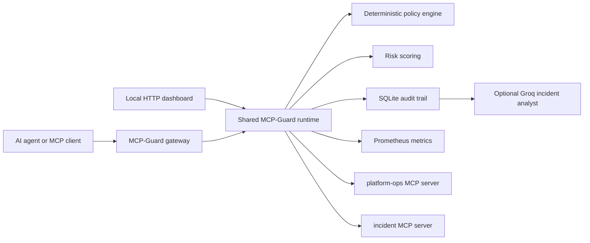

# MCP-Guard

MCP-Guard is a lightweight runtime firewall and reliability layer for Model Context Protocol (MCP) servers. It proxies MCP tool calls, applies deterministic policy before execution, redacts secrets afterward, and emits audit evidence and Prometheus-style metrics.

The demo is designed for a small laptop: Python standard library only, no containers, no local model, and no API key required. An optional Groq integration adds LLM-generated incident summaries without putting an LLM on the enforcement path.

## Why This Project

An MCP server can expose operationally powerful tools to an AI agent. The interesting production question is not whether the agent can call a tool. It is whether the platform can constrain, observe, disable, and explain those calls under pressure.

MCP-Guard demonstrates:

- MCP gateway proxying over JSON-RPC stdio
- Policy-as-code allowlists and blocked argument patterns
- HMAC-signed approval tokens for restart and rollback operations
- Deterministic risk scoring for production actions
- Secret redaction for audit logs and agent-visible responses
- Per-tool rate limits and immediate kill switches
- Correlation IDs, SQLite audit trails, and Prometheus metrics
- Optional Groq incident analysis with an offline fallback
- Optional OpenInference-compatible traces exported through OpenTelemetry
- Adversarial safety evals for unsafe tool-call attempts

## Architecture



The two upstream servers are separate subprocesses:

- `platform-ops`: production service health, sanitized config, logs, allowlisted diagnostics, rolling restart, and deployment rollback.
- `incident`: create incidents, attach correlated evidence, and read timelines.

## Quick Start

Requirements: macOS or Linux and Python 3.11+.

The launch scripts automatically use `.venv/bin/python` when a project virtual environment exists. Otherwise, they use the system `python3`.

To use an isolated audit database for a run:

```bash
./scripts/run_demo.sh --audit-db /tmp/mcp-guard-demo.db
```

```bash
./scripts/run_demo.sh
```

Common developer commands:

```bash
make test
make demo
make eval
make trace
```

Start the dashboard:

```bash
./scripts/run_dashboard.sh
```

Then open [http://127.0.0.1:8080](http://127.0.0.1:8080). The page includes buttons for allowed calls, blocked calls, an approved rollback drill, secret redaction, and kill-switch testing.

To expose MCP-Guard itself as a stdio MCP server:

```bash
./scripts/run_mcp_gateway.sh
```

For an MCP client configuration, use:

```json
{
  "mcpServers": {
    "mcp-guard": {
      "command": "/absolute/path/to/MCP-Guard/scripts/run_mcp_gateway.sh"
    }
  }
}
```

## Optional Groq Integration

The demo produces a deterministic local incident summary by default. To add a hosted LLM summary:

```bash
export GROQ_API_KEY="your-key"
export GROQ_MODEL="openai/gpt-oss-20b"
./scripts/run_demo.sh
```

The gateway keeps working if Groq is unavailable. Policy evaluation never depends on the model.

## Dashboard API

| Endpoint | Purpose |
| --- | --- |
| `GET /healthz` | Readiness check |
| `GET /api/tools` | List upstream MCP tools |
| `GET /api/events` | Read recent correlated audit events |
| `GET /api/kill-switches` | Read disabled tools and servers |
| `GET /api/telemetry` | Read OpenInference tracing mode and OTLP endpoint |
| `GET /metrics` | Prometheus-style counters |
| `POST /api/call` | Invoke a guarded tool |
| `POST /api/approval` | Issue a short-lived approval token |
| `POST /api/kill-switch` | Enable or disable a tool or server |
| `POST /api/analyze` | Summarize recent audit evidence |

Example:

```bash
curl -s http://127.0.0.1:8080/api/call \
  -H 'Content-Type: application/json' \
  -d '{"server":"platform-ops","tool":"platform.health","arguments":{"service":"payments-api"}}'
```

Issue a signed approval token for a rollback:

```bash
TOKEN=$(./scripts/python.sh -m mcp_guard.cli issue-approval \
  --actor gaurav \
  --reason "rollback after elevated 5xx rate" \
  --server platform-ops \
  --tool platform.rollback_deployment \
  --arguments '{"service":"payments-api","version":"payments-api@2026.05.2"}')

curl -s http://127.0.0.1:8080/api/call \
  -H 'Content-Type: application/json' \
  -d "{\"server\":\"platform-ops\",\"tool\":\"platform.rollback_deployment\",\"arguments\":{\"service\":\"payments-api\",\"version\":\"payments-api@2026.05.2\",\"approval_token\":\"$TOKEN\"}}"
```

## Test

```bash
PYTHONPATH=src ./scripts/python.sh -m unittest discover -s tests -v
```

The suite exercises the actual subprocess MCP boundary as well as allow, deny, redaction, approval, kill-switch, audit, and fallback-analysis behavior.

Run the adversarial eval harness:

```bash
./scripts/run_evals.sh
```

The evals cover unsafe diagnostics, unapproved destructive actions, unknown tools, safe diagnostics, health checks, and audit redaction. They are intentionally separate from unit tests so the demo can grow into a policy regression suite.

## Docker

Build and run the dashboard container:

```bash
make docker-build
docker run --rm -p 8080:8080 mcp-guard:local
```

## Optional OpenInference Tracing

The default demo has no third-party runtime dependencies. For AI-aware distributed traces, install the observability profile:

```bash
python3 -m pip install -e '.[observability]'
```

Print OpenInference-compatible spans to the terminal:

```bash
MCP_GUARD_TELEMETRY=console ./scripts/run_demo.sh
```

Export spans over OTLP HTTP to a local Phoenix instance or another OTLP-compatible backend:

```bash
export MCP_GUARD_TELEMETRY=otlp
export OTEL_EXPORTER_OTLP_TRACES_ENDPOINT=http://127.0.0.1:6006/v1/traces
./scripts/run_dashboard.sh
```

The trace hierarchy is intentionally security-aware:

```text
mcp_guard.call_tool                 CHAIN
  mcp_guard.policy.evaluate         GUARDRAIL
  mcp.platform.health               TOOL       # only created for forwarded calls
groq.incident_summary               LLM        # only created when Groq is called
```

Arguments and outputs are redacted before they are attached to spans. The upstream MCP subprocess protocol is implemented locally for this lightweight demo, so `openinference-instrumentation-mcp` auto-instrumentation is not used. If the transport is migrated to the official MCP Python SDK, that package can be added for cross-process context propagation.

## Threat Model

The MVP directly addresses:

- Agent attempts to access sensitive local paths such as `.ssh`, `.aws`, and `.env`.
- Agent attempts to run unsafe network commands in diagnostic arguments.
- Unauthorized restart or rollback actions.
- Secret leakage from upstream tool responses or recorded arguments.
- Repeated high-volume calls to expensive or destructive tools.
- Fast containment of a compromised tool or MCP server.

For a real deployment, the next hardening steps are authenticated Streamable HTTP transport, durable distributed rate limits, signed policy bundles, external secret management, OpenTelemetry traces, an append-only audit sink, and human approval integration.

## Design Notes

The short design write-up is in [docs/DESIGN_NOTES.md](docs/DESIGN_NOTES.md), and the production roadmap is in [docs/ROADMAP.md](docs/ROADMAP.md).

## License

This project is licensed under the Apache License 2.0. In brief, you may use, modify, distribute, and sublicense the code, including in commercial projects, as long as you preserve copyright and license notices. The license also includes an express patent grant and is provided without warranties.
