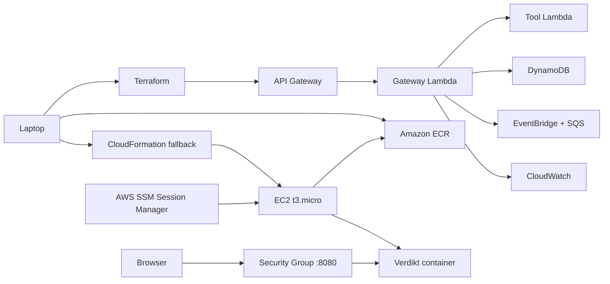

# AWS Free-Tier Deployment

This runbook deploys Verdikt to AWS using two infrastructure-as-code paths. The highest-signal AIOps path is serverless: API Gateway, Lambda, DynamoDB, EventBridge, SQS, CloudWatch, and Terraform. The real MCP path uses EC2, ECR, IAM, security groups, SSM Session Manager, Docker, the official MCP Python SDK, and Terraform. CloudFormation remains available as the AWS-native fallback.

## Cost Guardrails

AWS Free Tier changed in 2025. Your exact free usage depends on when your AWS account was created. Check the Billing console before deploying.

Recommended guardrails:

- Use one region, such as `us-east-1`.
- Use a Free Tier eligible EC2 type for your account, usually `t3.micro` for this guide.
- Delete the stack when you are done.
- Keep ECR images small and prune old tags.
- Set `VERDIKT_ALLOWED_CIDR` to your public IP `/32`; the templates otherwise fail closed to loopback-only access.
- Create a billing budget and alert in the AWS Billing console before experimenting.

## Architecture



## What This Teaches

- IAM roles for EC2
- Secrets Manager for bearer token and approval-token secrets
- ECR image build and push
- Terraform infrastructure as code
- Official MCP Streamable HTTP server on EC2/Docker
- API Gateway and Lambda serverless control planes
- DynamoDB state and audit modeling
- EventBridge, SQS, and dead-letter queues
- CloudWatch custom metrics, alarms, logs, and dashboards
- AWS X-Ray active tracing for Lambda paths
- CloudFormation as an AWS-native alternate path
- EC2 user data bootstrapping
- Security groups
- SSM Session Manager access
- Container deployment on Linux
- Cost-aware cleanup

## Prerequisites

```bash
aws --version
docker --version
aws configure
```

Confirm your identity:

```bash
aws sts get-caller-identity
```

If the ARN ends with `:root`, create an IAM user/role or use IAM Identity Center before deploying. The scripts intentionally block root-user deployment unless you set `VERDIKT_ALLOW_ROOT_AWS=true` for a one-off lab.

## Recommended Path: Serverless Terraform

The serverless module lives in [../infra/aws/serverless](../infra/aws/serverless). It manages API Gateway, Lambda, DynamoDB, EventBridge, SQS, CloudWatch, IAM, and operational dashboards.

```bash
export AWS_REGION=us-east-1
export VERDIKT_API_TOKEN="$(openssl rand -hex 24)"
export VERDIKT_APPROVAL_SECRET="$(openssl rand -hex 32)"
export VERDIKT_AUDIT_HMAC_SECRET="$(openssl rand -hex 32)"
./scripts/aws/deploy_serverless.sh
```

Then follow the examples in [../infra/aws/serverless/README.md](../infra/aws/serverless/README.md).

The API token, approval secret, and independent audit HMAC key are stored in Secrets Manager. Terraform creates the secret containers and IAM bindings; the deploy script writes the values with AWS CLI so live secret strings do not sit in Terraform state. Lambda receives only the secret ARNs and has scoped permission to read them.

Destroy it after demos:

```bash
./scripts/aws/destroy_serverless.sh
```

## Real MCP Path: EC2 Terraform

The Terraform module lives in [../infra/aws/terraform](../infra/aws/terraform). It manages ECR, IAM, security groups, SSM access, and the EC2 host. The Docker container defaults to `VERDIKT_MODE=real-mcp`, which runs the official MCP Streamable HTTP server at `/mcp`.

## 1. Deploy With Terraform

For an x86 EC2 instance such as `t3.micro`:

```bash
export AWS_REGION=us-east-1
export VERDIKT_DOCKER_PLATFORM=linux/amd64
export VERDIKT_MODE=real-mcp
export VERDIKT_HTTP_BEARER_TOKEN="$(openssl rand -hex 24)"
export VERDIKT_APPROVAL_SECRET="$(openssl rand -hex 32)"
export VERDIKT_AUDIT_HMAC_SECRET="$(openssl rand -hex 32)"
export VERDIKT_ALLOWED_CIDR="$(curl -s https://checkip.amazonaws.com)/32"
./scripts/aws/deploy_terraform.sh
```

Terraform creates Secrets Manager resources for the bearer token and approval secret, and the deploy script writes the values with AWS CLI. The EC2 instance role can read only those two secrets.

The script does three things:

1. Creates the ECR repository with Terraform.
2. Builds and pushes the Docker image to that repository.
3. Applies the rest of the Terraform stack and prints the dashboard URL.

For an ARM instance such as `t4g.micro`, use:

```bash
export VERDIKT_INSTANCE_TYPE=t4g.micro
export VERDIKT_DOCKER_PLATFORM=linux/arm64
export VERDIKT_AMI_SSM_PARAMETER=/aws/service/ami-amazon-linux-latest/al2023-ami-kernel-default-arm64
```

The same variable is shown in [../infra/aws/terraform/terraform.tfvars.example](../infra/aws/terraform/terraform.tfvars.example) for manual Terraform runs.

## 2. Smoke Test

Terraform prints `mcp_endpoint_url` and `dashboard_url`. In `real-mcp` mode, use `/healthz`, `/metrics`, and `/mcp`:

```bash
URL="http://<public-dns>:8080"
curl -s "$URL/healthz"
curl -s "$URL/metrics" -H "Authorization: Bearer $VERDIKT_HTTP_BEARER_TOKEN"
```

Use an MCP client pointed at:

```text
http://<public-dns>:8080/mcp
```

## 3. Operate The Instance

Connect without SSH keys:

```bash
aws ssm start-session --target <instance-id>
```

Inside the instance:

```bash
sudo docker ps
sudo docker logs verdikt --tail 100
curl -s http://127.0.0.1:8080/healthz
```

## 4. Delete Everything

```bash
./scripts/aws/destroy_terraform.sh
```

The Terraform ECR repository uses `force_delete = true` by default so demo cleanup removes pushed images too. In a stricter production setup, set `ecr_force_delete = false`.

## Alternate Path: CloudFormation

Use this if you want the simpler AWS-native path or want to compare both IaC styles in an interview.

## 1. Build And Push The Image

For an x86 EC2 instance such as `t3.micro`:

```bash
export AWS_REGION=us-east-1
export VERDIKT_DOCKER_PLATFORM=linux/amd64
IMAGE_URI=$(./scripts/aws/build_push_ecr.sh)
echo "$IMAGE_URI"
```

For an ARM instance such as `t4g.micro`, use:

```bash
export VERDIKT_DOCKER_PLATFORM=linux/arm64
```

If you choose ARM, also pass an ARM Amazon Linux 2023 AMI parameter in CloudFormation or edit `LatestAmiId`.

## 2. Deploy To EC2 With CloudFormation

Restrict the app to your IP:

```bash
export VERDIKT_ALLOWED_CIDR="$(curl -s https://checkip.amazonaws.com)/32"
```

Deploy:

```bash
./scripts/aws/deploy_ec2.sh "$IMAGE_URI"
```

CloudFormation prints a `DashboardUrl`. Open it in your browser.

## 3. Smoke Test The CloudFormation Stack

```bash
URL="http://<public-dns>:8080"
curl -s "$URL/healthz"
curl -s "$URL/api/tools"
curl -s "$URL/metrics"
```

Issue an approval token through the API:

```bash
curl -s "$URL/api/approval" \
  -H 'Content-Type: application/json' \
  -d '{
    "actor":"gaurav",
    "reason":"rollback after elevated 5xx rate",
    "server":"platform-ops",
    "tool":"platform.rollback_deployment",
    "arguments":{"service":"payments-api","version":"payments-api@2026.05.2"}
  }'
```

## 4. Operate The CloudFormation Instance

Connect without SSH keys:

```bash
aws ssm start-session --target <instance-id>
```

Inside the instance:

```bash
sudo docker ps
sudo docker logs verdikt --tail 100
curl -s http://127.0.0.1:8080/healthz
```

## 5. Delete The CloudFormation Stack

```bash
./scripts/aws/delete_stack.sh
aws cloudformation wait stack-delete-complete \
  --region "${AWS_REGION:-us-east-1}" \
  --stack-name "${VERDIKT_STACK_NAME:-verdikt-free-tier}"
```

Optional ECR cleanup:

```bash
aws ecr batch-delete-image \
  --region "${AWS_REGION:-us-east-1}" \
  --repository-name "${VERDIKT_ECR_REPOSITORY:-verdikt}" \
  --image-ids imageTag="${VERDIKT_IMAGE_TAG:-latest}"
```

## Resume Framing

Use this only after you have deployed and tested it:

> Deployed an MCP-based AIOps control plane to AWS Free Tier using Terraform, ECR, EC2, IAM instance roles, security groups, SSM Session Manager, Docker, Prometheus-style metrics, signed approvals, and adversarial safety evals. Also maintained a CloudFormation fallback to compare AWS-native and multi-cloud-style IaC.
