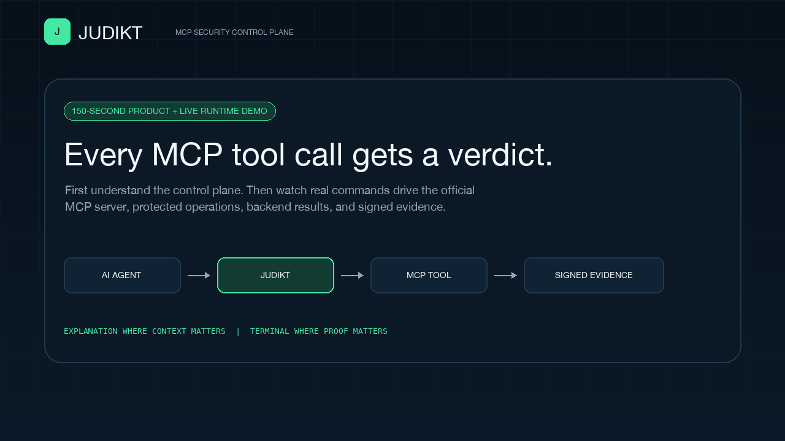

# Judikt 150-Second Hybrid Demo

The README recording deliberately uses two visual modes:

- Polished product slides explain the problem, purpose, control model, trust boundaries, production operability, and conceptual architecture.
- Terminal slides are mandatory whenever real input, processing, backend execution, output, metrics, or audit evidence is shown.

This keeps the story understandable without disguising runtime behavior as a product mockup.



## Timeline

The generated GIF is exactly 150 seconds and loops automatically.

1. Product introduction: what Judikt is and where it sits.
2. Production problem: overreach, confused-deputy risk, poisoned results, and weak evidence.
3. Request governance: identity, policy, risk, approval, rate limits, and blast-radius controls.
4. Response defense: definition pinning, injection scanning, quarantine, and redaction.
5. Trust boundaries: caller, gateway, MCP server, brokered credentials, and evidence systems.
6. Production operability: observability, persistence, deployment automation, and qualification.
7. Conceptual flowchart: agent to request gate, MCP server, response gate, and evidence fan-out.
8. Explicit handoff from explanation to captured terminal proof.
9. Real server launch, readiness, bearer-auth rejection, and official MCP discovery commands.
10. Actual allow, redaction, denial, approval, approved execution, dry-run, quarantine, and kill-switch commands.
11. Signed audit-chain, tool-pin, finding-delivery, and Prometheus evidence commands.
12. Incident creation, correlated evidence attachment, and timeline retrieval commands.
13. Live rate-limit exhaustion and circuit-breaker opening commands.
14. Real failure-drill, AttackBench, performance, remote MCP, and JWT qualification commands.
15. Polished closing summary.

Major outcomes remain visible for at least five seconds.

## Terminal proof

`scripts/record_demo.py` starts the production-facing MCP server as a real process:

```bash
./scripts/run_real_mcp_http.sh --policy "$TMP/policy.json" --audit-db "$TMP/audit.db" \
  --host 127.0.0.1 --port "$PORT" --log-level warning
```

It then runs 26 separate shell commands against that live process or an isolated qualification harness. Representative commands include:

```bash
curl -fsS "$JUDIKT_BASE_URL/healthz"
./scripts/mcp_client.sh list
./scripts/mcp_client.sh call platform.health --arguments '{"service":"payments-api"}'
./scripts/mcp_client.sh call platform.rollback_deployment --arguments-file config/demo/rollback.json
./scripts/mcp_client.sh call judikt.call_upstream --arguments-file config/demo/external-poisoned-response.json
./scripts/mcp_client.sh call judikt.runtime_state --arguments '{"limit":2}' \
  --select audit_integrity.valid --select audit_integrity.checked_events
./scripts/run_failure_tests.sh
./scripts/run_attackbench.sh tests/fixtures/attackbench_smoke.jsonl "$TMP/attackbench.json"
./scripts/run_performance_benchmark.sh "$TMP/performance.json" --iterations 25 --warmup 5
```

Each command and its combined stdout/stderr are captured as a pair. The renderer adds the green `$` prompt only to the exact command it executed; command output is rejected if it contains a fabricated prompt. Generation also fails unless the captures prove:

1. The official Streamable HTTP MCP transport initialized and advertised the real tool catalog.
2. Missing bearer authentication received HTTP `401`.
3. A safe production health read executed and returned a backend result.
4. A returned API key was redacted.
5. Unsafe arguments were denied before upstream execution.
6. A production rollback returned `REQUIRE_APPROVAL`.
7. A mode-`0600` token file authorized only the exact approved rollback without printing the token.
8. Kubernetes remediation returned `DRY_RUN_ONLY` without mutation.
9. A controlled external MCP response was quarantined without unsafe-text exposure.
10. An operator kill switch blocked a normally allowed tool and was then restored.
11. Eight events passed HMAC-signed hash-chain verification and appeared in Prometheus counters.
12. External tool metadata remained pinned and verified.
13. An incident was created, given correlated evidence, and read back through its timeline.
14. The live remote server enforced its per-tool rate limit and opened a circuit after repeated upstream failures.
15. Approval, kill-switch, circuit-breaker, redaction, and rate-limit failure drills passed.
16. The eight-sample AttackBench-compatible CI smoke thresholds passed without raw payloads in its report.
17. The guarded performance smoke threshold passed with a valid signed audit chain.
18. The complete Streamable HTTP and JWT authorization end-to-end suites passed.

## Reproduce it

Run the compact local walkthrough directly:

```bash
./scripts/run_demo.sh --audit-db /tmp/judikt-demo.db
```

Regenerate the complete 150-second hybrid media artifact:

```bash
python3 -m pip install -e '.[mcp,media]'
make demo-recording
```

This writes:

- `docs/assets/judikt-demo.gif`: looping 1280 x 720 hybrid walkthrough.
- `docs/assets/judikt-demo-poster.png`: static 1280 x 720 product cover.

The renderer enforces an exact 150,000 ms duration and fails if the terminal sequence leaves insufficient room for the final five-second close.

## Safety and accuracy

The recorder creates a temporary policy, SQLite audit database, tool-definition pin store, bearer token, approval secret, independent audit-signing secret, and mode-`0600` approval-token file. The poisoned response comes from `tests/fixtures/external_mcp_server.py`, which runs as a separate JSON-RPC stdio process behind the real HTTP MCP server. No cloud, LLM API, or production endpoint is contacted, and all temporary state is deleted after capture.

The platform and Kubernetes operations use deterministic local adapters; Kubernetes remains non-mutating unless explicitly switched to `kubectl` mode. The official MCP transport, bearer boundary, policy outcomes, approval verification, external subprocess call, response inspection, redaction, kill switch, metrics, and signed audit path shown in the terminal are the real project implementation.

## Publishing caption

> Judikt in 150 seconds: product context and architecture first, followed by actual commands against a live Streamable HTTP MCP server, deterministic verdicts, backend results, poisoned-response quarantine, failure drills, metrics, and signed audit verification.
