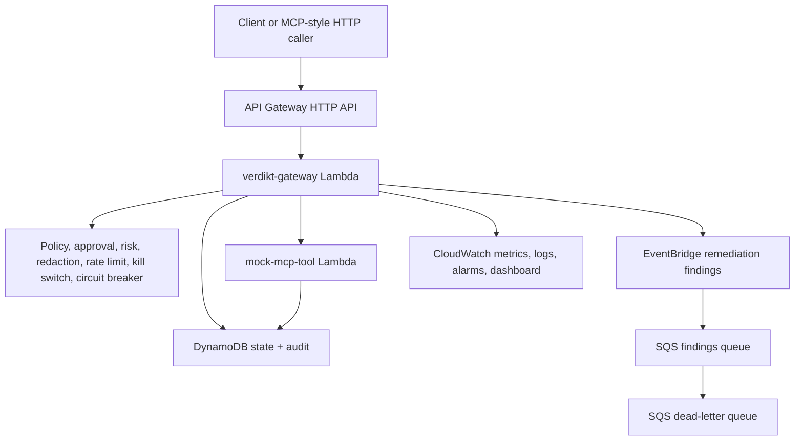

# Verdikt Serverless AWS Deployment

This is the higher-signal AWS deployment for Verdikt. It keeps the local policy engine idea, but runs the control plane through AWS-native services:



## What It Provisions

- API Gateway HTTP API with bearer-token enforcement in the gateway Lambda
- `verdikt-gateway` Lambda for deterministic policy enforcement
- `mock-mcp-tool` Lambda for production-like operational tools
- DynamoDB state table for policies, approvals, rate counters, kill switches, circuit breakers, and service state
- DynamoDB audit table with TTL
- EventBridge custom event bus for remediation findings
- SQS queue and dead-letter queue
- CloudWatch log groups, custom metrics, alarms, and dashboard
- AWS Secrets Manager for the API token, approval-token secret, and independent audit HMAC key
- AWS X-Ray active tracing for gateway and tool Lambda paths

## Deploy

From the repository root:

```bash
export AWS_REGION=us-east-1
export VERDIKT_API_TOKEN="$(openssl rand -hex 24)"
export VERDIKT_APPROVAL_SECRET="$(openssl rand -hex 32)"
export VERDIKT_AUDIT_HMAC_SECRET="$(openssl rand -hex 32)"
./scripts/aws/deploy_serverless.sh
```

Terraform creates all three Secrets Manager containers and gives the gateway Lambda scoped `secretsmanager:GetSecretValue` access. The deploy script writes the actual values with AWS CLI so the live secret strings are not owned by Terraform state. The audit key must remain independent from the approval-token key.

Use the `api_base_url` output:

```bash
URL="https://<api-id>.execute-api.us-east-1.amazonaws.com"

curl -s "$URL/healthz" \
  -H "Authorization: Bearer $VERDIKT_API_TOKEN"

curl -s "$URL/tools" \
  -H "Authorization: Bearer $VERDIKT_API_TOKEN"
```

Call an allowed read-only tool:

```bash
curl -s "$URL/call" \
  -H "Authorization: Bearer $VERDIKT_API_TOKEN" \
  -H "Content-Type: application/json" \
  -d '{"server":"platform-ops","tool":"platform.health","arguments":{"service":"payments-api"}}'
```

Try a blocked destructive action:

```bash
curl -s "$URL/call" \
  -H "Authorization: Bearer $VERDIKT_API_TOKEN" \
  -H "Content-Type: application/json" \
  -d '{"server":"platform-ops","tool":"platform.rollback_deployment","arguments":{"service":"payments-api","version":"payments-api@2026.05.2"}}'
```

Issue an approval token and retry:

```bash
TOKEN=$(curl -s "$URL/approval" \
  -H "Authorization: Bearer $VERDIKT_API_TOKEN" \
  -H "Content-Type: application/json" \
  -d '{"actor":"gaurav","reason":"rollback after elevated 5xx rate","server":"platform-ops","tool":"platform.rollback_deployment","arguments":{"service":"payments-api","version":"payments-api@2026.05.2"}}' \
  | python3 -c 'import json,sys; print(json.load(sys.stdin)["approval_token"])')

curl -s "$URL/call" \
  -H "Authorization: Bearer $VERDIKT_API_TOKEN" \
  -H "Content-Type: application/json" \
  -d "{\"server\":\"platform-ops\",\"tool\":\"platform.rollback_deployment\",\"arguments\":{\"service\":\"payments-api\",\"version\":\"payments-api@2026.05.2\",\"approval_token\":\"$TOKEN\"}}"
```

## Operate

Useful commands:

```bash
aws logs tail "/aws/lambda/verdikt-serverless-gateway" --follow
aws dynamodb scan --table-name verdikt-serverless-audit --limit 10
aws sqs receive-message --queue-url <findings_queue_url>
```

Open the CloudWatch dashboard named `verdikt-serverless-ops`.

## Destroy

```bash
./scripts/aws/destroy_serverless.sh
```

## Interview Framing

This path is stronger than the EC2 path for AIOps/LLMOps roles because it demonstrates event-driven architecture, serverless security boundaries, DynamoDB state modeling, custom CloudWatch metrics, alarms, operational audit trails, and Terraform-managed cloud infrastructure.
